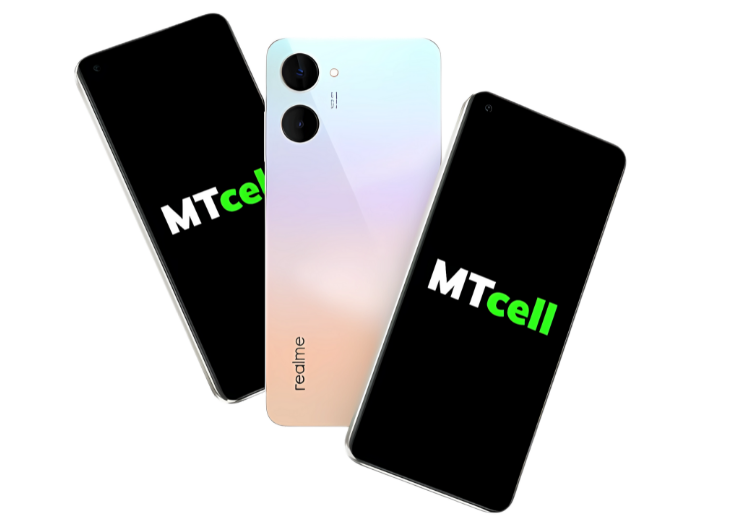

  <ul style="list-style: none">
    

      <h1>
            
            MTCell
      </h1>
    

  </ul>

Desenvolvimento de um site moderno, prático e de fácil navegação para a
empresa MTcell, especializada no comércio de eletrônicos. O projeto visa digitalizar as
operações da empresa, promovendo a integração de tecnologias e ampliando a presença da
marca no ambiente virtual.

## 👨‍💻 Desenvolvedores 

## 🛠️ Tecnologias utilizadas

